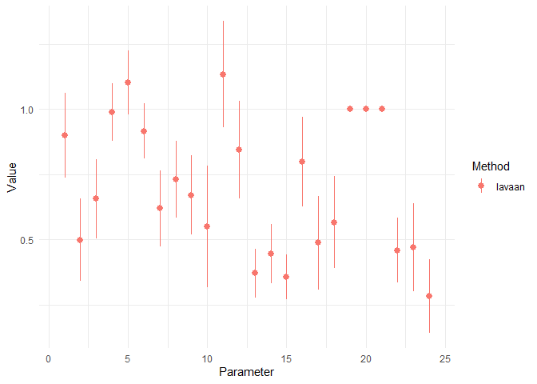
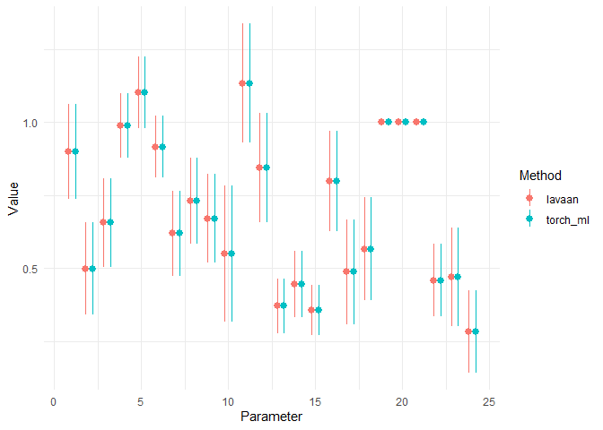
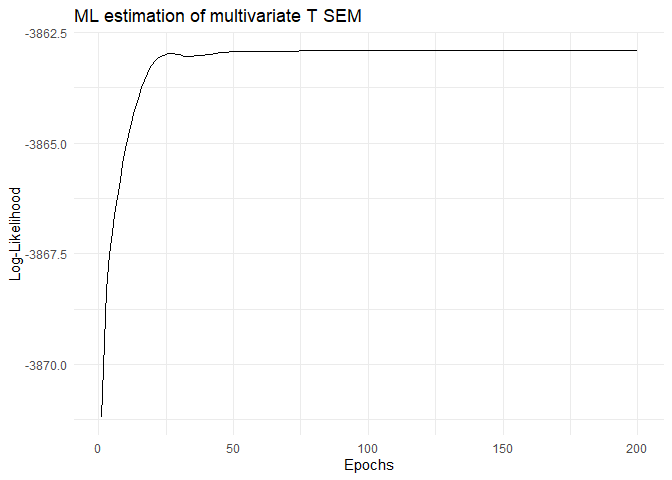
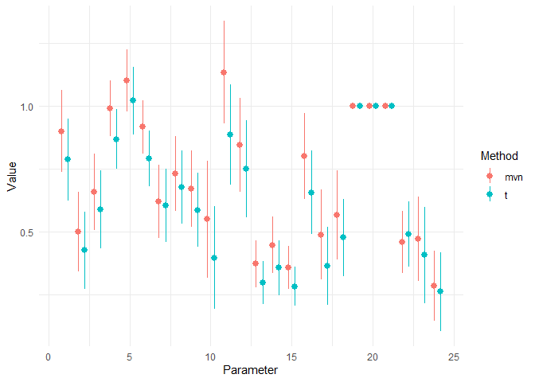
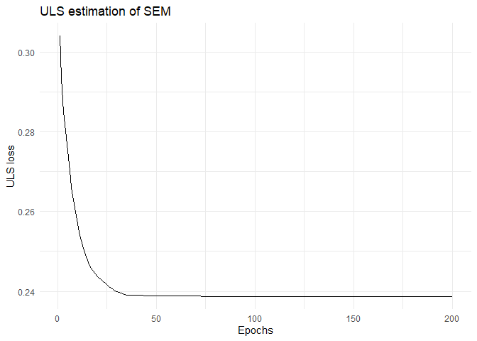
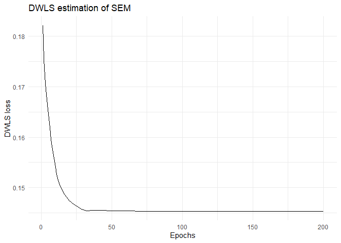
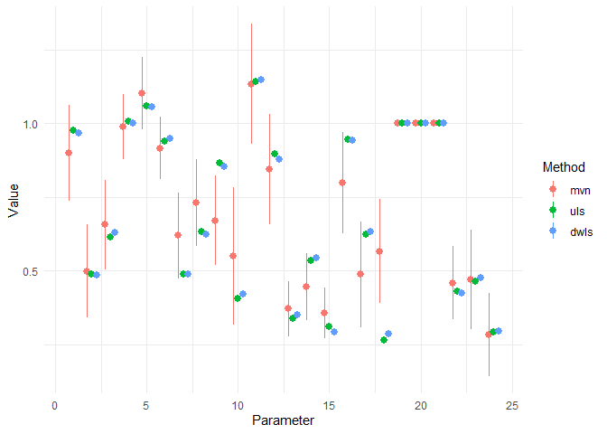
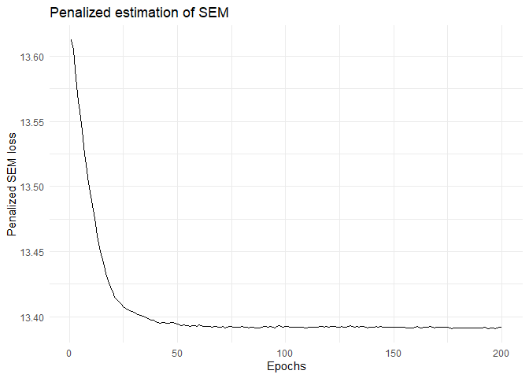

# Custom loss functions for SEM with `tensorsem`

``` r
library(tensorsem)
```

With `tensorsem` we can estimate structural equation models using
maximum likelihood (ML), but we can also go beyond standard multivariate
normal ML to estimate the parameters. For example, we can create a
robust form of SEM by using a multivariate t-distribution instead of a
multivariate normal distribution for the observations. We can also
perform unweighted least squares or weighted least squares. Lastly, we
can put custom penalties on any parameter in the model.

The machinery that enables all these custom objective functions is
automatic differentiation (through `torch`) and adaptive gradient-based
optimization algorithms, such as `optim_adam`. In this vignette, we show
how this can be done.

## Maximum likelihood estimation

Maximum likelihood estimation is the default in `lavaan`, so that’s what
we’ll compare to.

``` r
# Create model syntax
syntax <- "
  # three-factor model
  visual  =~ x1 + x2 + x3
  textual =~ x4 + x5 + x6
  speed   =~ x7 + x8 + x9
"

# Fit lavaan model
fit_lavaan <- sem(
  model = syntax,
  data = HolzingerSwineford1939,
  std.lv = TRUE,
  information = "observed",
  fixed.x = FALSE
)

pt_lavaan <- partable(fit_lavaan)
```

And, in order to visually compare the different estimation methods, we
create a custom plot function:

``` r
param_plot <- function(...) {
  ptli <- list(...)
  ptli <- lapply(names(ptli), function(n) {
    out <- ptli[[n]]
    out$method <- n
    return(out)
  })
  Reduce(rbind, ptli) |> 
    ggplot2::ggplot(ggplot2::aes(x = id, y = est, colour = forcats::as_factor(method),
               ymin = est - 1.96*se, ymax = est + 1.96*se)) + 
    ggplot2::geom_pointrange(position = ggplot2::position_dodge(width = .8)) +
    ggplot2::theme_minimal() +
    ggplot2::labs(x = "Parameter", y = "Value", colour = "Method")
}

param_plot(lavaan = pt_lavaan)
```

<!-- -->

Now, we will estimate this same model using `tensorsem`:

``` r
# initialize the SEM model object
mod_ml <- torch_sem(syntax, dtype = torch_float64())

# create a data object as a torch tensor
dat_torch <- torch_tensor(
  data = scale(HolzingerSwineford1939[,7:15], scale = FALSE),
  requires_grad = FALSE,
  dtype = torch_float64(),
)

# estimate the model using default settings
mod_ml$fit(dat = dat_torch, verbose = FALSE)
#> Fitting SEM with Adam optimizer and MVN log-likelihood loss

# re-compute the log-likelihood & create partable
ll <- mod_ml$loglik(dat_torch)
pt_ml <- mod_ml$partable(-ll)

# compare to lavaan
param_plot(
  lavaan = pt_lavaan,
  torch_ml = pt_ml
)
```

<!-- -->

As we can see, the two methods yield practically the same parameter
estimates and standard errors.

## Robust t-distributed SEM

Next, we’ll change the loss function to the negative log-likelihood of a
multivariate t-distribution with 2 degrees of freedom for each variable.

``` r
# Create a multivariate t log-likelihood distribution using torch operations
# inspiration: https://docs.pyro.ai/en/stable/_modules/pyro/distributions/multivariate_studentt.html
# note that that code is APACHE-2.0 licensed
mvt_loglik <- function(x, Sigma, nu = 2) {
  p <- x$shape[2]
  n <- x$shape[1]
  
  Schol <- linalg_cholesky(Sigma)

  # constant term
  C <- Schol$diag()$log()$sum() +  p/2*torch_log(nu) + 
    p/2*log(pi) + torch_lgamma(nu / 2) - 
    torch_lgamma((p + nu) / 2)
  
  # data-dependent term
  y <- x$t()$triangular_solve(Schol, upper = FALSE)[[1]]
  D <- torch_log1p(y$square()$sum(1) / nu)
  
  return(-0.5 * (nu + p) * D - C)
}
```

Now, we will use this distribution as the loss function.

``` r
# initialize the SEM model object
mod_t <- torch_sem(syntax, dtype = torch_float64())

# initialize at the ml estimates for faster convergence
mod_t$load_state_dict(mod_ml$state_dict())

# initialize the optimizer
opt <- optim_adam(mod_t$parameters, lr = 0.01)

# start the training loop
iters <- 200L
loglik <- numeric(iters)
for (i in 1:iters) {
  opt$zero_grad()
  Sigma <- mod_t()
  loss <- -mvt_loglik(dat_torch, Sigma)$sum()
  loglik[i] <- -loss$item()
  loss$backward()
  opt$step()
}
```

Then, we can plot the optimization trajectory to see whether it’s
converged:

``` r
opt_plot <- function(losses) {
  ggplot2::ggplot(data.frame(x = 1:length(losses), y = losses), ggplot2::aes(x, y)) + 
    ggplot2::geom_line() +
    ggplot2::theme_minimal()
}
opt_plot(loglik) +
  ggplot2::labs(x = "Epochs", y = "Log-Likelihood", title = "ML estimation of multivariate T SEM")
```

<!-- -->

Then, we can again compare the parameter estimates:

``` r
# re-compute the log-likelihood & create partable
ll <- mvt_loglik(dat_torch, mod_t())$sum()
pt_t <- mod_t$partable(-ll)

# compare to lavaan
param_plot(mvn = pt_ml, t = pt_t)
```

<!-- -->

## Unweighted and Diagonally weighted least squares

By half-vectorizing the model-implied and observed covariance matrices,
we can create versions of least squares for estimating SEM.

``` r
uls_loss <- function(s, Sigma) {
  r <- s - torch_vech(Sigma)
  r$t()$mm(r)
}
```

Let’s try it out!

``` r
# initialize the SEM model object
mod_uls <- torch_sem(syntax, dtype = torch_float64())

# initialize at the ml estimates for faster convergence
mod_uls$load_state_dict(mod_ml$state_dict())

# initialize the optimizer
opt <- optim_adam(mod_uls$parameters, lr = 0.01)

# compute s
s <- torch_vech(dat_torch$t()$mm(dat_torch) / 301)

# start the training loop
iters <- 200L
losses <- numeric(iters)
for (i in 1:iters) {
  opt$zero_grad()
  Sigma <- mod_uls()
  loss <- uls_loss(s, Sigma)
  losses[i] <- loss$item()
  loss$backward()
  opt$step()
}
```

Then, we can plot the loss path & compare parameters

``` r
opt_plot(losses) +
  ggplot2::labs(x = "Epochs", y = "ULS loss", title = "ULS estimation of SEM")
```

<!-- -->

Similarly, we can perform dwls by using the Asymptotic Distribution Free
Gamma matrix

``` r
dwls_loss <- function(s, Sigma, w) {
  r <- s - torch_vech(Sigma)
  r$t()$mul(w)$mm(r)
}
```

``` r
# initialize the SEM model object
mod_dwls <- torch_sem(syntax, dtype = torch_float64())

# initialize at the ml estimates for faster convergence
mod_dwls$load_state_dict(mod_ml$state_dict())

# initialize the optimizer
opt <- optim_adam(mod_dwls$parameters, lr = 0.01)

# compute weights for DWLS, based on
# asymptotic distribution free Gamma matrix
Gamma_ADF <- lavaan:::lavGamma(fit_lavaan)[[1]]
w <- torch_tensor(1 / diag(Gamma_ADF), dtype = torch_float64(), requires_grad = FALSE)

# start the training loop
iters <- 200L
losses <- numeric(iters)
for (i in 1:iters) {
  opt$zero_grad()
  Sigma <- mod_dwls()
  loss <- dwls_loss(s, Sigma, w)
  losses[i] <- loss$item()
  loss$backward()
  opt$step()
}
```

Then we can again plot the loss path

``` r
opt_plot(losses) +
  ggplot2::labs(x = "Epochs", y = "DWLS loss", title = "DWLS estimation of SEM")
```

<!-- -->

``` r
pt_uls <- mod_uls$partable()
pt_dwls <- mod_dwls$partable()

# compare to lavaan
param_plot(mvn = pt_ml, uls = pt_uls, dwls = pt_dwls)
#> Warning: Removed 42 rows containing missing values (geom_segment).
```

<!-- -->

## Custom penalties

Using a penalty we can adjust the maximum likelihood objective. For
example, it is possible to specify an EFA, with L1 (LASSO) penalties on
the factor loadings (in the Lambda matrix).

``` r
# Create model syntax
syntax <- "
  # three-factor model
  visual + textual + speed =~ x1 + x2 + x3 + x4 + x5 + x6 + x7 + x8 + x9
  
  # no correlations between the factors
  visual ~~ 0*textual
  visual ~~ 0*speed
  textual ~~ 0*speed
"

mod_efa <- torch_sem(syntax, dtype = torch_float64())
mod_efa$load_state_dict(mod_ml$state_dict())

# lambda is the penalty hyperparameter
lambda <- torch_tensor(0.15)

# initialize the optimizer
opt <- optim_adam(mod_efa$parameters, lr = 0.01)


# start the training loop
iters <- 200L
losses <- numeric(iters)
for (i in 1:iters) {
  opt$zero_grad()
  Sigma <- mod_efa()
  loss <- mvn_negloglik(dat_torch, Sigma) / 301 + lambda * mod_efa$Lam$abs()$sum()
  losses[i] <- loss$item()
  loss$backward()
  opt$step()
}
```

As always, we can plot the loss over training iterations:

``` r
opt_plot(losses) +
  ggplot2::labs(x = "Epochs", y = "Penalized SEM loss", title = "Penalized estimation of SEM")
```

<!-- -->

Let’s see whether the procedure allowed a cross-loading:

``` r
load <- as_array(mod_efa$Lam)
colnames(load) <- c("visual", "textual", "speed")
rownames(load) <- paste0("x", 1:9)
round(load, 2)
#>    visual textual speed
#> x1   0.51    0.21  0.01
#> x2   0.26    0.00  0.00
#> x3   0.51    0.00  0.00
#> x4   0.01    0.79  0.00
#> x5   0.00    0.88  0.00
#> x6   0.03    0.72  0.00
#> x7   0.00    0.00  0.51
#> x8   0.09    0.00  0.57
#> x9   0.30    0.04  0.33
```

It allowed a quite strong cross-loading between the factor “speed” and
item “x9”, as well as between “textual” and “x1”.
